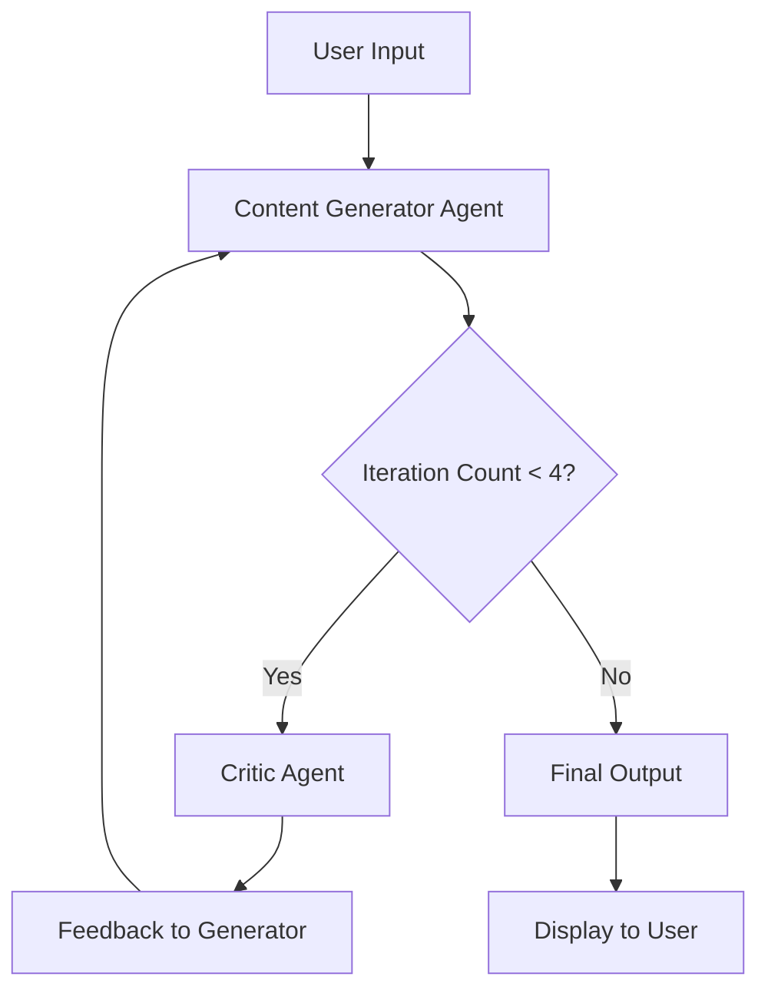

# LinkedIn Agent with Reflection Pattern

An intelligent agent system built with TypeScript, LangChain, and LangGraph that generates high-quality LinkedIn content using the Reflection pattern for iterative improvement and self-critique.

## 🚀 Features

- **AI-Powered Content Generation**: Leverages Groq's LLM for creating engaging LinkedIn posts
- **Reflection Pattern Implementation**: Iterative self-improvement through critic-agent feedback loops
- **Interactive Console Interface**: Real-time user interaction with graceful exit handling
- **Modular Architecture**: Clean separation of concerns with dedicated state, prompts, and LLM modules
- **TypeScript Support**: Full type safety and modern JavaScript runtime with Bun

## 🏗️ Architecture & Reflection Pattern

### Overview

This project implements the **Reflection pattern**, an advanced agentic workflow where an initial agent generates content, followed by a critic agent that evaluates and provides feedback. The system iterates through this cycle, allowing the content generator to refine its output based on constructive criticism, resulting in higher-quality final content.

### Key Components

- **Content Generator Agent**: Creates initial LinkedIn posts based on user input
- **Critic Agent**: Analyzes the generated content and provides improvement suggestions
- **State Management**: Tracks conversation history and iteration count
- **Conditional Flow Control**: Determines when to continue iterating or terminate

### Reflection Flow Diagram



### Detailed Workflow

1. **Initialization**: User provides a topic or prompt
2. **Generation Phase**: The Content Generator Agent creates an initial LinkedIn post using the system prompt
3. **Evaluation Phase**: The Critic Agent reviews the generated content against quality criteria
4. **Feedback Integration**: Critic feedback is added as a new human message to the conversation history
5. **Iteration Control**: The system checks if the maximum iteration count (4) has been reached
6. **Termination**: When satisfied or max iterations reached, the final content is presented

This pattern ensures continuous improvement while preventing infinite loops through iteration limits.

## 📦 Installation

### Prerequisites

- [Bun](https://bun.sh/) runtime (v1.3.11 or later)
- Node.js (for compatibility, though Bun is preferred)

### Setup

1. Clone the repository:
   ```bash
   git clone <repository-url>
   cd linkedin_agent_reflexion
   ```

2. Install dependencies:
   ```bash
   bun install
   ```

3. Configure your Groq API key (ensure it's set in your environment or LLM configuration)

## 🚀 Usage

### Running the Application

Start the interactive console:
```bash
bun run index.ts
```

### Interaction

- Enter your desired LinkedIn post topic or content request
- The agent will generate and refine content through multiple iterations
- Type `bye` to exit the application

Example interaction:
```
Enter your message (type "bye" to exit): How to learn React effectively?
Final Response: { messages: [...], repeatCount: 3 }
```

## 📁 Project Structure

```
linkedin_agent_reflexion/
├── index.ts                 # Main application entry point
├── package.json             # Project dependencies and scripts
├── tsconfig.json           # TypeScript configuration
├── README.md               # This file
├── Modal/
│   └── llm.ts              # LLM configuration and setup
├── prompt/
│   └── prompt.ts           # System prompts for agents
└── state/
    └── State.ts            # State annotation and management
```

## 🛠️ Dependencies

### Core Dependencies
- **@langchain/core**: Core LangChain functionality
- **@langchain/groq**: Groq LLM integration
- **@langchain/langgraph**: Graph-based agent orchestration

### Development Dependencies
- **@types/bun**: TypeScript definitions for Bun
- **typescript**: TypeScript compiler

## 🔧 Configuration

### LLM Setup
Configure your LLM in `Modal/llm.ts`:
```typescript
// Example configuration
export const llm = new ChatGroq({
  apiKey: process.env.GROQ_API_KEY,
  model: "your-preferred-model",
  temperature: 0.7,
});
```

### Prompts
Customize agent behavior by modifying prompts in `prompt/prompt.ts`:
- `createLinkdinAgentPrompt`: Instructions for content generation
- `criticPrompt`: Criteria for content evaluation

## 🤝 Contributing

1. Fork the repository
2. Create a feature branch: `git checkout -b feature/your-feature`
3. Commit changes: `git commit -am 'Add your feature'`
4. Push to branch: `git push origin feature/your-feature`
5. Submit a pull request

## 📄 License

This project is licensed under the MIT License - see the LICENSE file for details.

## 🙏 Acknowledgments

- Built with [LangChain](https://www.langchain.com/) and [LangGraph](https://langchain-ai.github.io/langgraph/)
- Powered by [Groq](https://groq.com/) for fast LLM inference
- Inspired by the Reflection pattern for agent self-improvement

---

For questions or support, please open an issue on the GitHub repository.
